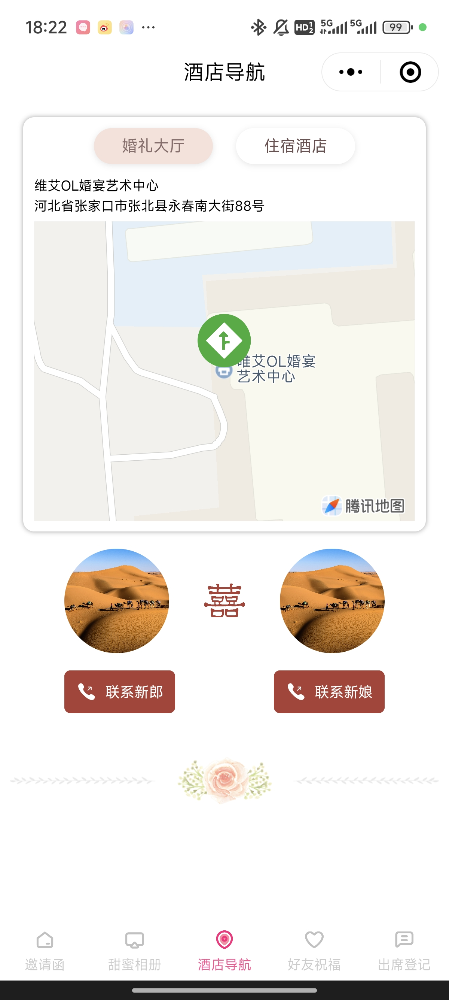
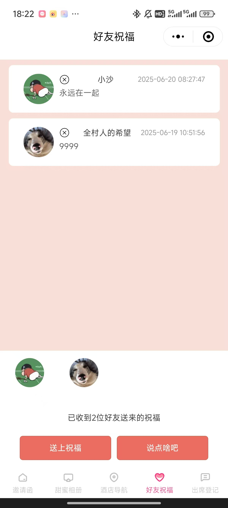
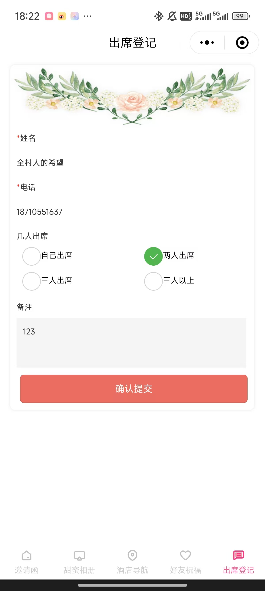
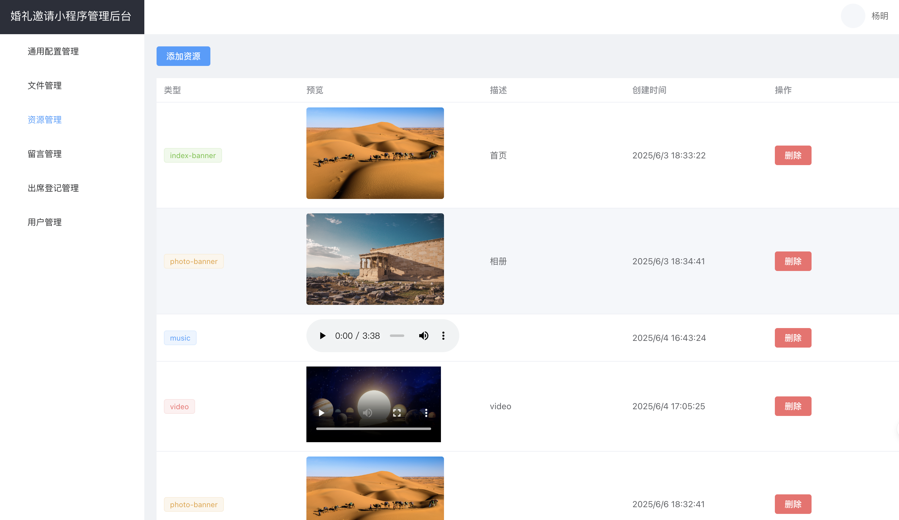

## 基于 uniapp + vue3 + ts + vite 的婚礼邀请函微信小程序


## 巨人的肩膀
> 本项目整体结构来源于 [zouyaoji/wedding-invitation](https://github.com/zouyaoji/wedding-invitation.git) 项目，首页换成了 [JaminQ/wedding-invitation](https://github.com/JaminQ/wedding-invitation.git)，在此向前辈 [zouyaoji](https://github.com/zouyaoji) 和 [JaminQ](https://github.com/JaminQ) 致敬。
>
> 另外本人对前端技术栈并不熟悉，因此本项目中部分代码由 AI 生成

## 小程序主要功能 & 改动点
包含婚礼邀请函、甜蜜相册、酒店导航、好友祝福和出席登记五个页面

  ### 婚礼邀请函（即首页）
  把 [zouyaoji/wedding-invitation](https://github.com/zouyaoji/wedding-invitation.git) 项目的首页替换成了 [JaminQ/wedding-invitation](https://github.com/JaminQ/wedding-invitation.git) 的 H5 形式，但由于后者是原生小程序代码，所以本人进行了必要的调整以融合到 uniapp 风格，几乎保留了全部内容，并新增了倒计时功能

  

  ### 甜蜜相册
  换成了双列的静态展示，配合顶部轮播

  

  ### 酒店导航
  优化了地图组件样式，更换了联系新郎和联系新娘的组件，同时区分了 “婚礼大厅” 和 “住宿酒店” 两个 Marker 点

  

  ### 好友祝福
  将原来的 “好友祝福” 和 “留言评论” 融合成了这一个页面，上下布局，分别展示留言和送上祝福的好友微信头像，留言时自动送上祝福

  

  ### 出席登记
  将原来 “留言评论” 页面中的 “我要出席” 按钮对应的逻辑和页面，单独安排成这一个页面，因为我觉得出席登记这个事毕竟还是挺重要的
  
  

  ### 其他改动点
  - 删除了所有关于微信云开发的保留代码，意味着此项目完全不支持微信云开发，如果想用云开发的朋友请移步 [zouyaoji/wedding-invitation](https://github.com/zouyaoji/wedding-invitation.git)，或参考其使用，自行调整
  - 强化了 “小程序过审魔法开关”，将这个值通过后端存储进行配置，方便随时设置某些组件的显隐，来轻松过审

## 主要配置
- 小程序的 AppId，需要分别配置在 project.config.json 和 manifest.json(这里有两处) 中
- VITE_VUE_APP_API，位于 .env 中，你的后端服务地址，注意开发阶段可以不是 https，但是正式发布小程序时要求必须是 https 的
- VITE_VUE_APP_USERID，位于 .env 中，这个是需要先在后端服务中注册一个用户，才能拿到用户 ID，所有接口都会基于这个用户 ID 去获取数据
- 其他的具体页面的配置，都在每个页面的 `<script>` 部分, 自己按需修改就好了

## 开发、调试、代码上传
开发工具：
- [微信开发者工具](https://developers.weixin.qq.com/miniprogram/dev/devtools/download.html)：用于小程序的预览和调试
- [BuilderX](https://dcloud.io/hbuilderx.html)：项目是基于 uniapp 的，HBuilderX 支持一键将 uniapp 项目运行到各种模拟端，其中包括微信开发者工具

开发流程：
```bash
git clone https://github.com/ymstar/happy-wedding.git
cd happy-wedding
pnpm install
```
使用 HBuilderX 打开 happy-wedding 文件夹，点击 运行 -> 运行到小程序模拟器 -> 微信开发者工具

后续修改代码，将会自动实时编译

预览调试完成后，直接在 微信开发者工具 点击 “上传” 进行代码上传，后续动作就需要到微信开发者平台的小程序管理端进行操作了，进行体验版配置，或者提交审核

## 关于审核
- 主体为个人的小程序，不能包含任何类似社区的功能，例如发送留言、登记出席等，因此包含此类内容，正常是审核不通过的
- 所以本项目通过一个全局的魔法开关，开控制某些组件的显隐，这个开关存储在后端配置中，可以通过修改数据库的值，随时控制组件的显隐，实现高效过审
- 小程序审核周期一般在 2-7 个工作日，个人经验一般在 2-3 个工作日，新人免费赠送一个加速包，有加速包的情况下，基本当天就能审核，最好在体验端体验没问题了再上传审核，缩短审核周期

## 关于后端
> - 后端代码是从 [zouyaoji/wedding-invitation](https://github.com/zouyaoji/wedding-invitation.git) 处获取而来，但由于是 nodejs+pgsql，本人并不熟悉，因此本人将必要的接口重写成了 java+mysql 版本
> - 因为原本后端服务只提供了 swagger 接口，而且由于有认证的问题，使用起来非常不方便，所以本人开发了一个简单的后台管理系统，支持登录、文件管理、出席登记导出等功能，使用起来就非常方便了




后端代码获取：
- 打赏任意金额，获取小程序配套后端代码包，代码包中包含部署和使用教程
- 打赏金额超 100+，赠送后台管理系统代码包，包含部署和使用教程

> 注意：项目的部署需要一定的代码基础和开发经验，本人只提供代码，不提供部署和维护以及咨询等服务。

## 打赏
微信  /  支付宝
> 备注个人邮箱，方便接收代码包

 


## 其他
其他问题请查看 uniapp 官方文档。
